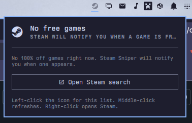

# Steam Sniper for Omarchy

[](https://omarchy.org/)
[](manifest.json)
[](LICENSE)

A small Quickshell bar widget that watches Steam for games that are currently
free and notifies you when a new one appears.



It polls the same search the store uses for 100% off games:

```
https://store.steampowered.com/search/?sort_by=_ASC&hwtype=0&maxprice=free&category1=998&supportedlang=english&specials=1
```

That is games on sale for free, not the permanent free-to-play catalogue.

## Install

```bash
omarchy plugin add https://github.com/nille/omarchy-steam-sniper --enable
```

Without `--enable`, add it later through **Omarchy menu -> Bar -> Widgets**,
or run:

```bash
omarchy plugin enable nille.steam-sniper --section right
```

No build step, API key, login, helper daemon, or extra package. It uses
`curl` and `omarchy-notification-send`, both already on Omarchy.

## Use

The bar icon is dim when nothing is free and full-strength when there is at
least one claimable game.

| Action | Result |
| --- | --- |
| Left-click the icon | Open or close the current free-game list |
| Middle-click the icon | Refresh immediately |
| Right-click the icon | Open the Steam search |
| Click a game | Open that store page |
| `r` in the panel | Refresh |
| `o` in the panel | Open the Steam search |
| `j` / `k` then Enter | Move through the list and open a game |

The first successful check after install is silent, so a restart does not
replay games you have already been told about. After that, a newly free
game sends one desktop notification. Clicking the notification opens the
store page, or the search if several games appeared at once.

Seen IDs are stored at:

```text
$XDG_STATE_HOME/omarchy-steam-sniper/seen.json
```

When `XDG_STATE_HOME` is unset, this is
`~/.local/state/omarchy-steam-sniper/seen.json`.

## Settings

| Key | Default | What it does |
| --- | --- | --- |
| `refreshMinutes` | `15` | How often to check Steam. Clamped to 5–180. |
| `hideWhenEmpty` | `false` | Remove the bar icon when nothing is free. |
| `notificationsEnabled` | `true` | Send a desktop notification for newly free games. |
| `country` | `""` | Optional two-letter Steam country (`US`, `DE`, `GB`). Empty lets Steam choose from your network. |

```bash
omarchy bar set nille.steam-sniper refreshMinutes 30 --json
omarchy bar set nille.steam-sniper hideWhenEmpty true --json
omarchy bar set nille.steam-sniper country US
```

## Uninstall

```bash
omarchy plugin disable nille.steam-sniper
omarchy plugin remove nille.steam-sniper
```

Optionally remove the seen-id file:

```bash
rm -rf ~/.local/state/omarchy-steam-sniper
```

## Development

```bash
omarchy plugin validate .
tests/qml/run
tests/qml/lint
```

Launch the standalone live-data harness:

```bash
tests/harness/run
```

`Model.js` contains URL building, HTML/JSON parsing, seen-id transitions,
and notification copy. `Panel.qml` owns transport, persistence, and
rendering. Harness notifications are disabled.

## Troubleshooting

- **The list is empty:** there may be no 100% off games right now. That is
  the usual state. The widget stays quiet until Steam puts one on.
- **A notification does not appear:** the first snapshot after install is
  silent, and later alerts only fire for IDs that were not already seen.
- **A change does not reload during development:** run
  `omarchy-shell shell rescanPlugins` or `omarchy restart shell`.

This is an independent community plugin. It is not affiliated with or
endorsed by Valve or Steam.

## License

[MIT](LICENSE)
